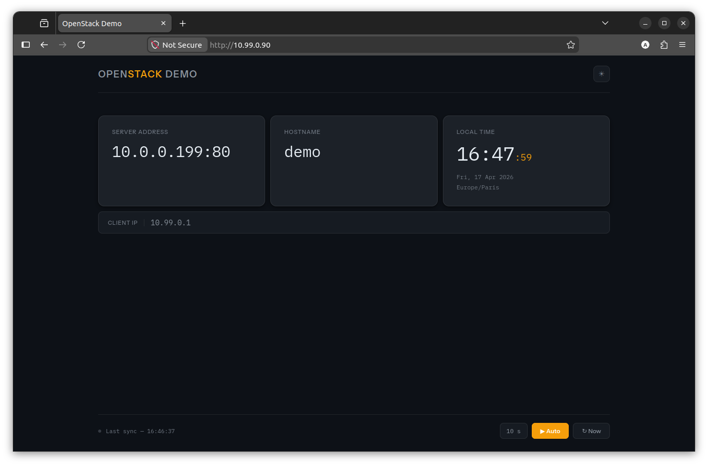

# openstack-demo-site

A bootable qcow2 disk image (Ubuntu 24.04) ready for OpenStack Glance. The instance runs nginx and serves a live dashboard displaying server and client network information.



## Requirements

```bash
sudo apt install qemu-utils libguestfs-tools qemu-system-x86 wget
```

## Build

```bash
make                         # produces dist/openstack-demo.qcow2 (~4 GB)
make IMAGE=my.qcow2 SIZE=4G  # custom output name and disk size
make clean
```

The first run downloads the Ubuntu 24.04 cloud base image (~600 MB), cached at `~/.cache/ubuntu-cloud-images/`.

> **Requires `sudo`** — libguestfs needs read access to `/boot/vmlinuz-*`.

| Variable | Default | Description |
|----------|---------|-------------|
| `IMAGE`  | `dist/openstack-demo.qcow2` | Output filename |
| `SIZE`   | `4G` | Disk size |
| `ROOTPW` | `demo` | Root password injected into the image |

## Local preview (no build needed)

```bash
./preview.sh            # serves web/ on port 8080 and opens the browser
PORT=3000 ./preview.sh
```

Starts a Python mock server that mimics the nginx `/info` endpoint. Press Ctrl+C to stop.

## Test the built image locally

```bash
qemu-system-x86_64 -m 512 -drive file=openstack-demo.qcow2,format=qcow2 \
  -netdev user,id=net0,hostfwd=tcp::8080-:80 -device virtio-net,netdev=net0 \
  -nographic
```

Open `http://localhost:8080`. Login: `root` / `demo`.

## Upload to OpenStack

```bash
openstack image create \
  --file openstack-demo.qcow2 \
  --disk-format qcow2 \
  --container-format bare \
  openstack-demo
```

## How it works

The build pipeline chains: `wget` → `qemu-img convert` → `qemu-img resize` → `virt-customize` (growpart, nginx install, web files) → `virt-sysprep` → `virt-sparsify`.

nginx exposes a `/info` endpoint that returns a JSON object built from built-in variables (no backend process). The frontend fetches it on load and on each auto-refresh tick, updating the cards in place.

## Project layout

```
web/index.html      Single-file frontend (HTML + CSS + JS, no build step)
nginx/default       nginx vhost config deployed to /etc/nginx/sites-available/
Makefile            Drives the full build pipeline
preview.sh          Local dev server — serves web/ and mocks /info
```
